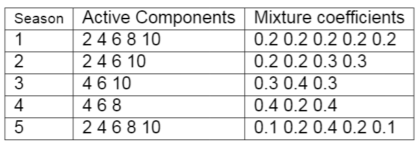
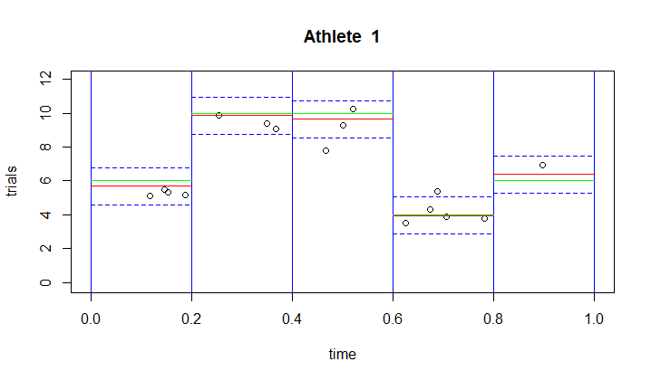
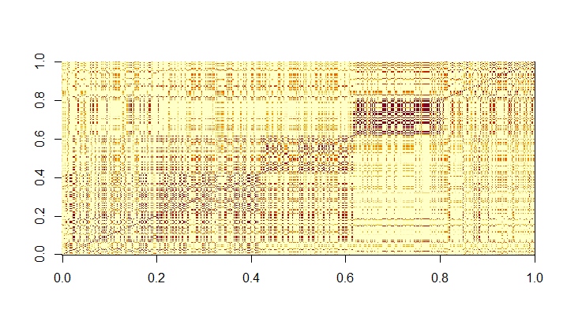
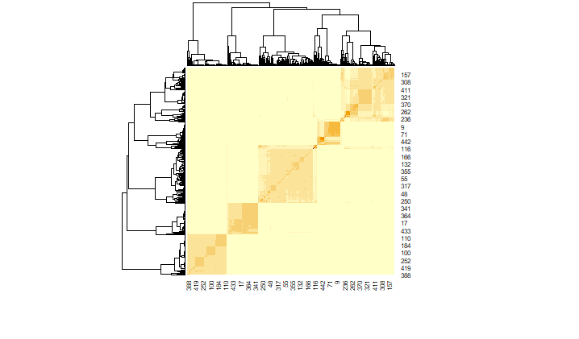
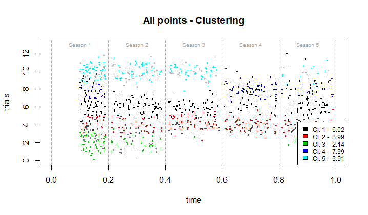
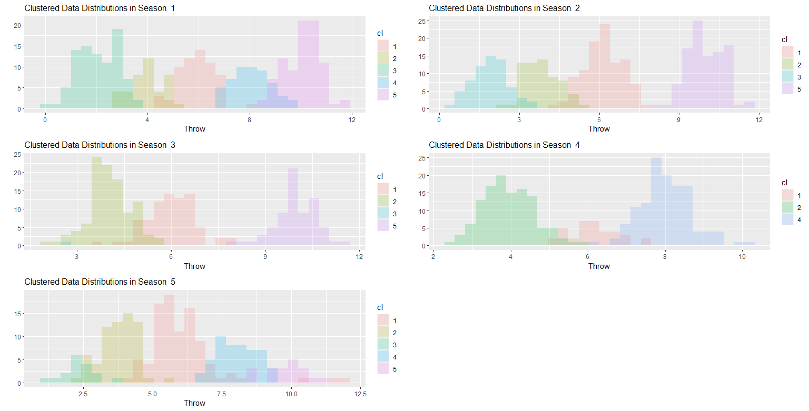
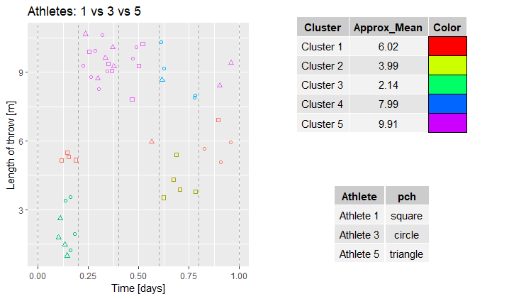

# Model implemented
In this section is implemented the sampler of the model we actually choose to use in the step function estimation task.

Note that the variance is accounted for through the use of an IG prior, but kept outside of the mixture. Refer to the Project Report for more details as usual.

# Simulated data generation
Simulated data have an important role in this case, since they allow to understand if the model works correctly on data similar to the real ones, but more manageable from a computational point of view.

In particular, we considered:
  * Five season
  * One hundred athletes
  * Each athlete performs a number of trials per season which is sampled from a Poisson. In the first two seasons athletes are forced to participate, while non participation is allowed from
    season 3 onwards.

In each season the chosen number of trials is sampled from a apriori chosen mixture (See table). Each mixture component has a variance slightly jittered around 0.5. 

Note that, if new data want to be tested, all can be tweaked by acting on the NN_DataGenerator script: note that, in this case, structures to be fed to the sampler slightly changes,
and some additional ones are needed in order to perform results analysis. In particular, when generating new data, be sure to save:
* Activity_Matrix.RData:  specifies if each athlete compete or not in each season. (matrix)
* Times.RData: specifies, per each athlete in each season, the times at which each trial is performed. (list)
* Complete_Data.RData: specifies the trials of each athlete, framing them in season. If the athlete does not participate, NA is provided. (list)
* True_Mean_matrix: specifies the actual mixture component from which the athlete trials were sampled, per each season. Provided in order to check the goodness of fit in case of 
                    simulated data. (matrix)

# Important note: feeding data to the sampler
Note that the sampler requires an additional data structure:

* Data.csv: file containing ALL performance records generated sequentially in one line. Ordering of data is: season 1 athlete 1 trials (variable length), season 1 athlete 2 trials, etc.
            IMPORTANT NOTE: only actual recordings are provided. If athlete 3 does not perform in season 1, simply nothing is appended after trials of athlete 2. This is done to speed up computation,
                            perventing the sampler to deal with missing data.
* Dims.csv: file containing number of athletes competing in each season, sequentially in one line.
* per_athlete_dims.csv: per each active athlete in each season, the number of trials performed. Ordering followed is the same as in Data.csv

Even if it may seems a little complicated, this structure permits the sampler to avoid dealing with missing numbers, and produce a gain both in terms of speed and required memory.

However, the version of the data_parser provided deal with data formatted in this way, so be sure to stick to these instructions.

# Sampler Interface
If the aim is only using the sampler, acting on the main.cpp script provided is sufficient.  

Data.csv and Dims.csv are provided simply through their paths, the data_parser provided does all the rest automatically.

A Sampler class instance is then built using those two.

Sampler parameters MUST be tweaked at this point, if needed. Here a list of the all the available setters:
* set_burnin(int n) : set the number of iterations to be burned. (We strongly suggests to decide burnin in post processing, however it is useful when trials must be repeated)
* set_n_iter(int n) : set number of total iterations
* set_mu0(double m) : mean of mixture component
* set_tau(double t) : variance of mixture component
* set_alpha(double al) : first level HDP parameter
* set_gamma(double gam) : second level HDP parameter 
* set_a(double a): IG parameter (out of mixture)
* set_b(double b): IG parameter (out of mixture)
* void set_sigma_start(double s0) : starting value for sigma MCMC chain
* set_clust(const vector<int>& clust_): initial number of clusters per season. (initialization performed as usual via kmeans)
* set_debug(size_t deb): if an existing athlete index (with respect to the ones provided to the sampler, namely the sum of all components in Dims) is provided, shows some additional 
                         information while running the algorithm.
  
Then, Initialize function must be called.

Sampling start the algorithm, Print shows the hidden state of the sampler.

Save estimates produces four .csv files in the working directory:
  1. Clust_estimates: in each row, reports the clustering of all observations per each iteration.
  2. Mu_estimates: in each row, reports the estimates for mu of all observations per each iteration.
  3. Sigma_estimates: one row, containing the estimates for sigma at each iteraion-
 
Please note that in this version of the sampler we focus on sigma and mu estimates, as well as the latent partition induced. Thus, the predictive density estimation methods are deprecated.
However, they can represent a possible addition to the sampler implementation.

# Analysis example
In the following are shown some plots, produced during post processing.

Example of guessed mixture components for athlete 1. Dashed blue lines represent 95% span of a gaussian.

Posterior similarity matrix and relative clustermap: spotting of the true five groups is already visible

All points, divided per seasons, coloured according to cluster belonging. Cluster mean levels.

Latent partition showed in each season: true underlying structure of generated data seems to be guessed properly.

Comparison of athlete 1, 3 and 5 

 
