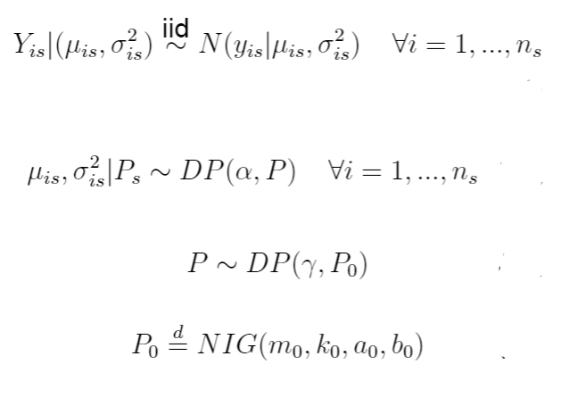
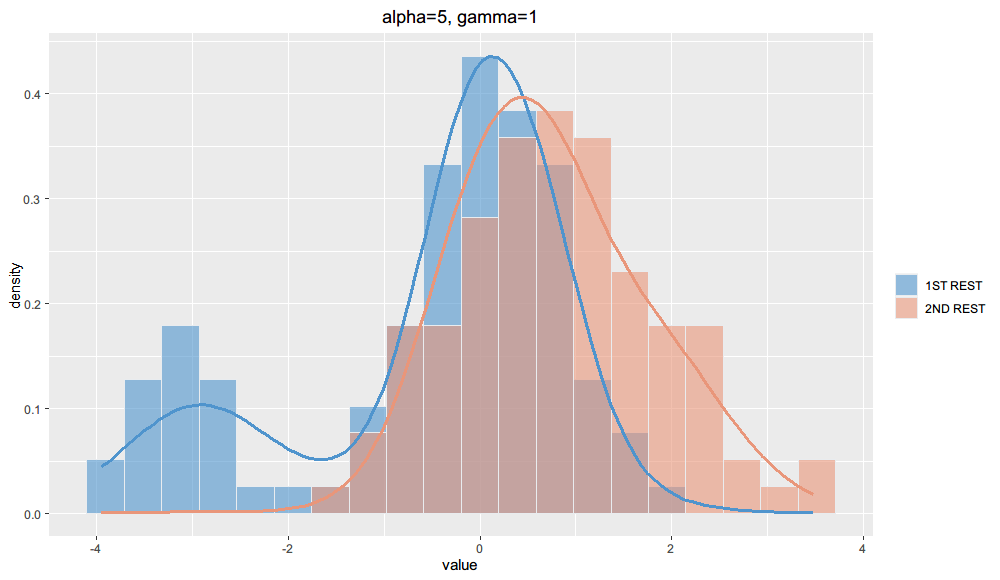
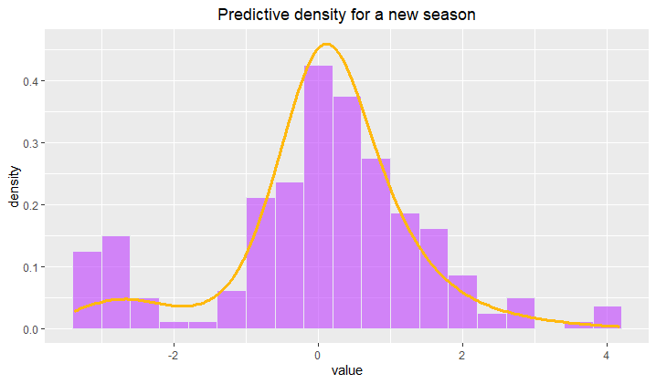

# Model implemented

# Aim
This sampler was developed to evaluate the chance of considering a bivariate mixture component (couple Mu - Sigma), accordingly to the model provided. Moreover, once again the ability of borrowing of information is tested.

For further details, see Section 3.3 of the Project Report.

# Simulated data generation
Simulated data are generated according to the following:

Note that, if new data want to be tested, all can be tweaked straightforwardly by acting on the NN_DataGenerator script.

# Important note: feeding data to the sampler
Note that the Data Generator arranges the created data in a particular way, which is the one requested by the sampler: data are saved in .csv format (Data.csv), all in a single line, and another .csv file containing dimensions per season is saved aswell (Dims.csv). 

# Sampler Interface
If the aim is only using the sampler, acting on the main.cpp script provided is sufficient.

Data.csv and Dims.csv are provided simply through their paths, the data_parser provided does all the rest automatically.

A Sampler class instance is then built using those two.

Sampler parameters MUST be tweaked at this point, if needed. Here a list of the all the available setters:
* set_burnin(int n) : set the number of iterations to be burned. (We strongly suggests to decide burnin in post processing, however it is useful when trials must be repeated)
* set_n_iter(int n) : set number of total iterations
* set_m0(double m) : N (mean)
* set_k0(double t) : N (variance)
* set_a0(double m) : IG
* set_b0(double t) : IG
* set_alpha(double al) : first level HDP parameter
* set_gamma(double gam) : second level HDP parameter 
* set_clust(const vector<int>& clust_): initial number of clusters per season. 
  
Then, Initialize function must be called.

Initialize_grid permits to specify the fining of the grid on which the predictive densities will be evaluated for each season.

Sampling start the algorithm, Print shows the hidden state of the sampler.

Save estimates produces five .csv files in the working directory:
  1. Clust_estimates: in each row, reports the clustering of all observations per each iteration.
  2. Mu_estimates: in each row, reports the estimates for mu of all observations per each iteration.
  3. grid: values of the grid created
  4. predictive: each row contains the corresponing season estimates for the predictive in each point of the grid
  5. predictiveNew: new features; allow to evaluate predictive density considering an hypothethic new season, taking into account all information provided in the others
 
 An important note: MCMC estimates of mu and clustering are provided for completeness, but we do not focus particularly on them at this stage.
 
 # Example : Borrowing of information & predictive of a new season
 As it can be seen from the considered simulated data, the component centered in 0.5 in the second season can be masked by the other one in a classical analysis.
 Thanks to the borrowing, as it is shared with the first group (where it the principal one), the predictive in the second restaurant is pulled a bit towards 0.5.
 
 
 
 Predictive of a new season is influenced by all the components:
 
 
 
 
 
 
