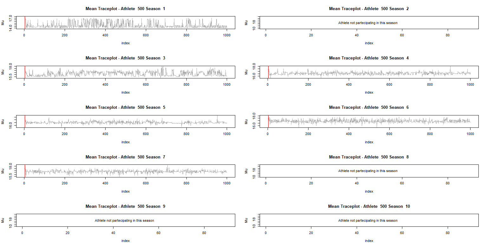
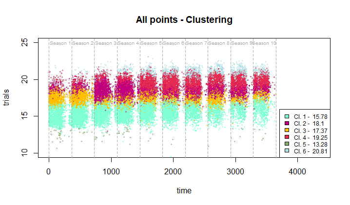

# A note on Shotput Dataset processing
As already pointed out the Shotput Dataset is not available publicly in this repository. However, in order to make (almost) everything reproducible, data structures obtained during pre processing of a subset of the dataset are saved in Pre processing / Data. Feeding them to the Multiple Throws Sampler produces the structures already available in the subfolder "Post Processing".

# An idea of what it is like

