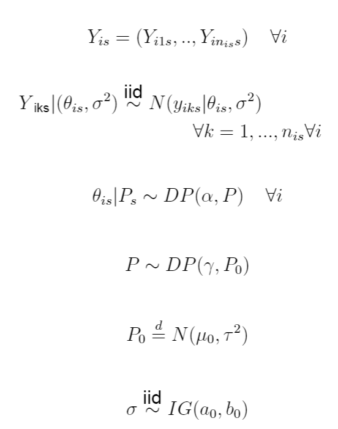
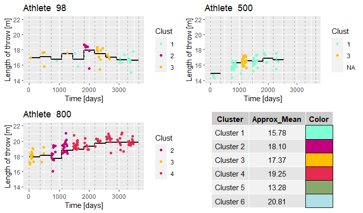

# Hierarchical Nonparametric Bayesian Models to smooth functional data
Project carried out during Bayesian Statistics course of PoliMi, 2021. Special thanks to Prof. Raffaele Argiento.

This repository contains a CPP implementend version of Gibbs Sampler for the following Hierarchical Dirichlet Mixture Model:

It was designed in order to carry out a task of functional smoothing for grouped data, in particular to estimate the step functional component of sport performances 
data contained in the Shotput Dataset. Please refer to the Project Report for details about context and further research.

Repository contais also implementations of Gibbs Samplers designed for slightly different models. Refer to specific Readme files for their formulations and purposes.

# Repository organization
An index to move through folders:

* Multiple Throws: presented version
   * Data Generation: simulated data to test the sampler                       [R]
   * Results Analysis: script to analyze results produced by the sampler       [R]
   * Sampler: CPP implementation                                               [Cpp]
   * Readme : model specification and notes
* NIG: Normal-Inverse Gamma version
   * Data Generation: simulated data to test the sampler                       [R]
   * Results Analysis: script to analyze results produced by the sampler       [R]
   * Sampler: CPP implementation                                               [Cpp]
   * Readme : model specification and notes
* NN: Normal-Normal version
   * Data Generation: simulated data to test the sampler                       [R]
   * Results Analysis: script to analyze results produced by the sampler       [R]
   * Sampler: CPP implementation                                               [Cpp]
   * Readme : model specification and notes
* Shotput: 
   * Pre processing: script used to arrange data to feed them to the sampler   [R]
   * Post processing: script to analyze results produced by the sampler        [R]
   
Please note that:

1. All simulated data resulting from the Data Generation scripts are already provided in order to make each part of the code already available to be tested, as well as 
   results of the sampling procedure.
2. Real dataset is not provided, but post processing of the sampler results can be tested using the structures present in the folder.   

# Requirements
No particular requirements is needed: all R packages used are common ones; the only particular one (relative to Wade's code) is downloadable from github as shown in the scripts where it is used.

Code in Cpp is raw and only need a standard compiler.

# Interfacing 
A specific interface between samplers (in Cpp) and data generators/results analysis scripts (R) is not provided, thus as a general rule the procedure to follow is:
1. Generate data / arrange data in order to be fed to the sampler and save the created structures.
2. Run the samplers passing the data structures created at point 1. Sampler saves automatically all the results in his working directory.
3. Load the sampler results in R to perform analysis.
